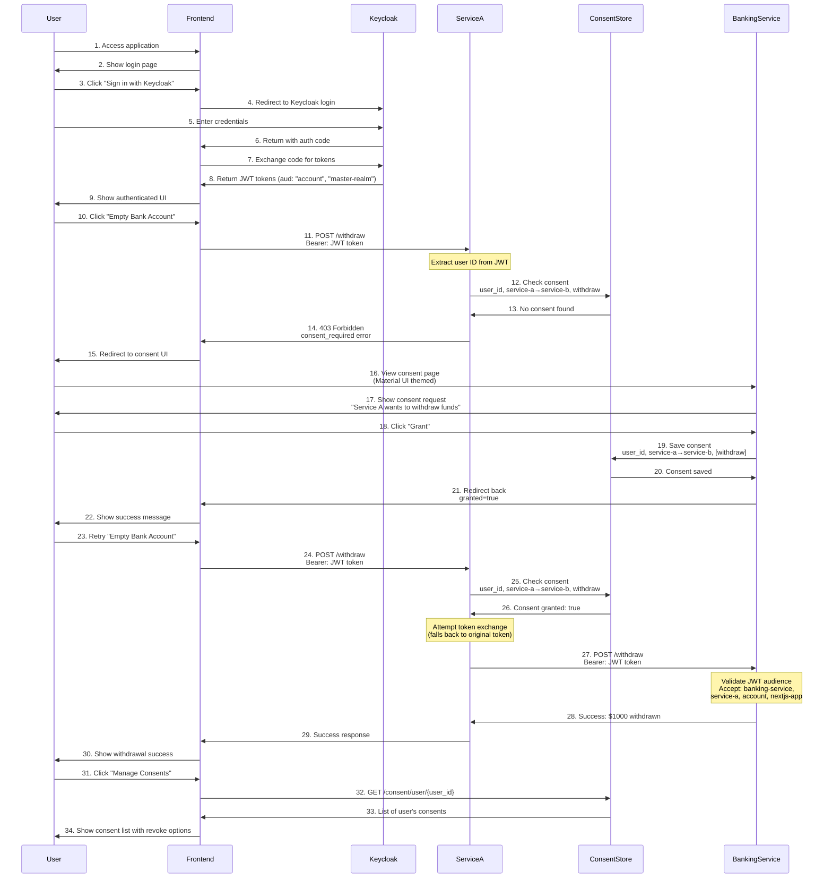
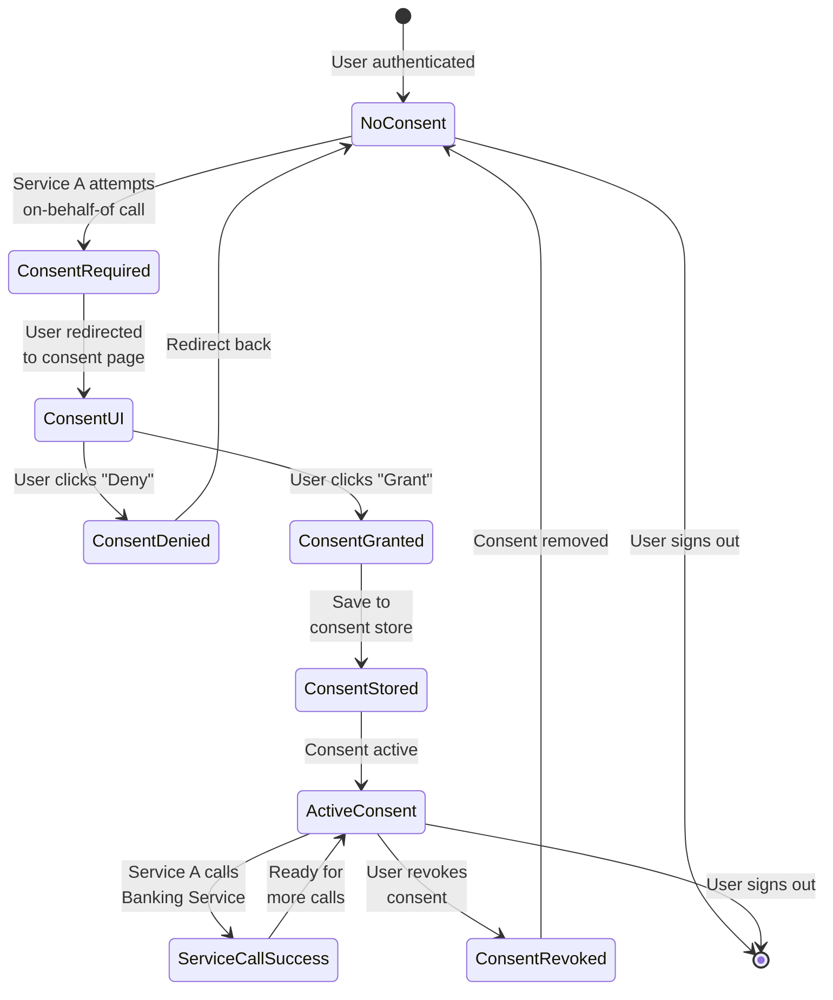

# On-Behalf-Of OAuth2 Demo

This project demonstrates the OAuth2 "on-behalf-of" authorization pattern combined with a consent management system. It showcases how services can act on behalf of users to access other protected services, but only after explicit user consent has been granted.

## Purpose

The demo illustrates a real-world scenario where:
- **Service A** needs to call **Banking Service** on behalf of a user
- Users must explicitly grant consent for Service A to perform specific actions (like withdrawals)
- All services are protected by JWT tokens with proper audience validation
- A consent store manages and persists user authorization decisions

This pattern is crucial for:
- Protecting user privacy and control over their data
- Implementing fine-grained permissions between microservices
- Building trust in multi-service architectures
- Complying with data protection regulations

## Video Walkthrough

[](https://www.youtube.com/watch?v=Bfw0QB_TJ-A)

Watch the video above for a complete walkthrough of the on-behalf-of OAuth2 consent flow implementation.

## Architecture

### System Components

```mermaid
graph TB
    subgraph "User Interface"
        UI[NextJS Frontend<br/>Port: 3005]
    end
    
    subgraph "Identity Provider"
        KC[Keycloak<br/>Port: 8080]
    end
    
    subgraph "Microservices"
        SA[Service A<br/>Port: 8004<br/>Acts on-behalf-of users]
        BS[Banking Service<br/>Port: 8012<br/>Protected resource]
        HS[Hello Service<br/>Port: 8003<br/>Unprotected]
    end
    
    subgraph "Consent Management"
        CS[Consent Store<br/>Port: 8001<br/>SQLite DB]
    end
    
    UI -->|Authenticate| KC
    UI -->|Call with JWT| SA
    UI -->|Direct call| HS
    SA -->|Check consent| CS
    SA -->|On-behalf-of call| BS
    BS -->|Save consent| CS
    BS -->|Consent UI| UI
    
    style UI fill:#1e3a5f
    style KC fill:#4a5568
    style SA fill:#2d3748
    style BS fill:#2d3748
    style HS fill:#2d3748
    style CS fill:#4a5568
```



### System Components Details

- **Keycloak**: Identity and Access Management (OAuth2/OIDC provider)
- **Consent Store**: Manages application capabilities and user consent decisions
- **Service A**: Acts on behalf of users to call other services
- **Banking Service**: Protected service requiring specific JWT audience claims
- **Hello Service**: Simple unprotected service for comparison
- **NextJS Frontend**: User interface with Pico CSS dark theme for authentication and service interaction

### How It Works

The following diagram illustrates the complete on-behalf-of OAuth2 consent flow:



### Consent Lifecycle



### Key Security Features

1. **JWT Audience Validation**: Banking service validates that tokens have the correct audience claim
2. **Consent Checking**: Service A always checks consent before calling protected services
3. **User Control**: Users can grant/revoke consent at any time through the UI
4. **CSRF Protection**: State tokens prevent cross-site request forgery in consent flow
5. **Scoped Permissions**: Consent is granted for specific capabilities (withdraw, view_balance, transfer)

## Features

- OAuth2/OIDC authentication via Keycloak
- Service-to-service authorization with JWT validation
- Explicit consent management system with UI
- Beautiful dark-themed UI with gradient buttons
- User-friendly consent management interface
- Support for both local and external IP access
- Optional Google authentication integration

## Getting Started

### Prerequisites

- Docker and Docker Compose
- Python 3.x
- Node.js 20+
- Make

### Quick Start

1. Clone the repository:
```bash
git clone <repository-url>
cd on-behalf-of-demo
```

2. **Setup Process (3 Steps)**:

   **Step 1: Stop any existing services**
   ```bash
   make stop
   ```

   **Step 2: Configure the services** (optional but recommended)
   ```bash
   ./setup-env.sh
   ```
   This will prompt you to configure:
   - Local service hosts and ports
   - External IP addresses for remote access
   - Keycloak configuration
   - Frontend environment settings

   **Step 3: Start and setup all services**
   ```bash
   make setup
   ```
   This command will:
   - Start backend services (Keycloak, consent-store, etc.)
   - Configure Keycloak clients automatically
   - Update frontend with correct client secrets (no race conditions)
   - Start frontend with finalized configuration
   - Set up the consent store with applications and capabilities
   - Wait for all services to come online

### Alternative Configuration Options

**Option 1: Use Default Configuration**
- Skip step 2 - works out of the box with default IPs and ports

**Option 2: Manual Configuration**
```bash
cp .env.example .env
# Edit .env file with your specific IP addresses and ports
```

For detailed configuration options and examples, see [CONFIGURATION.md](CONFIGURATION.md).

3. Access the services:
- **Frontend**: http://localhost:3005 or http://10.1.1.74:3005
- **Keycloak Admin**: http://localhost:8080 (admin/admin)
- **Consent Store API**: http://localhost:8001
- **Banking Service**: http://localhost:8012
- **Hello Service**: http://localhost:8003
- **Service A**: http://localhost:8004

## Testing the Flow

1. Navigate to the frontend at http://localhost:3005
2. Click "Sign in with Keycloak"
3. Login with the test user credentials or admin account
4. Test the "Say Hello" button - this should work immediately (unprotected service)
5. Test the "Empty Bank Account" button - this will fail with a consent error
6. Click "Manage Consents" to access the consent management UI
7. Grant consent for service-a to use service-b's withdraw capability
8. Return to home and retry "Empty Bank Account" - it should now succeed

### Quick Test with Pre-granted Consent

To quickly test the full flow with pre-granted consent:
```bash
./grant-test-consent.sh
```

This grants consent for both admin and testuser to allow service-a to perform withdrawals.

## Useful Commands

```bash
# Complete setup (recommended workflow)
make stop               # Stop existing services
./setup-env.sh         # Configure environment (optional)
make setup              # Start and configure all services

# Alternative commands
make all                # Quick start with defaults + show secrets
make start              # Start all services only (no configuration)

# Maintenance commands
make logs               # View logs
make show-secrets       # Show client secrets
make stop               # Stop all services
make restart            # Stop and start all services

# Development commands
make start-backend      # Start only backend services
make start-frontend     # Start only frontend
make setup-clients      # Configure Keycloak clients only
make setup-consent-store # Configure consent store only

# Optional features
make configure-google-auth GOOGLE_CLIENT_ID=your-id GOOGLE_CLIENT_SECRET=your-secret
```

## API Endpoints

### Consent Store
- `POST /applications` - Register an application
- `PUT /applications/{app_id}/capabilities` - Add capability to application
- `GET /consent/check` - Check if user granted consent
- `POST /consent` - Record user consent
- `DELETE /consent/user/{user_id}` - Clear user consents

### Service A
- `POST /withdraw` - Attempt to withdraw money on behalf of user (requires consent)

### Banking Service  
- `POST /withdraw` - Withdraw money (requires JWT with correct audience)

### Hello Service
- `GET /hello` - Simple greeting (no authentication required)

## Development

The project uses:
- FastAPI for microservices
- NextJS with NextAuth for frontend
- Pico CSS for beautiful dark theme UI
- SQLite for consent store persistence
- Docker Compose for orchestration

## Security Considerations

- All JWT tokens are validated for proper audience claims
- Services communicate over Docker network internally
- CORS is configured for specific origins only
- Secrets are automatically synchronized between Keycloak and services
- SSL can be enabled for production deployments

## License

This is a demonstration project for educational purposes.